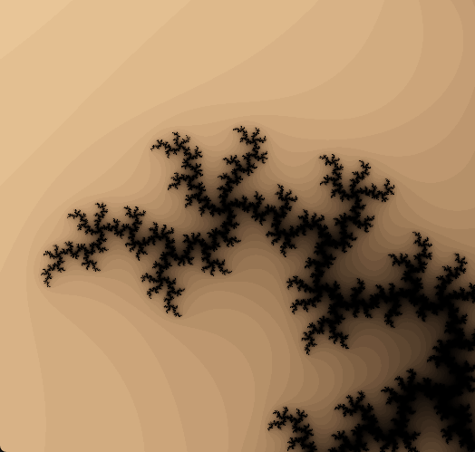

# Mandelbrot

Mandelbrot set explorer.




WASD to move around, Q/E to zoom in/out. Hold space to move/zoom faster.

Zoom is limited by 64-bit precision.

## Building

The project can be built with CMake and vcpkg installed.  
VCPKG_TOOLCHAIN_FILE environment variable should be set to the path of vcpkg.cmake.

Example:
```
git clone https://github.com/Akameki/mandelbrot.git
cd mandelbrot
cmake -B build -DCMAKE_BUILD_TYPE=Release
cmake --build build
./build/mandelbrot
```

All libraries are statically linked.

## License
MIT