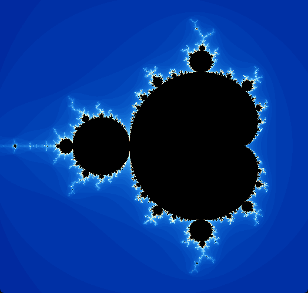

# Mandelbrot

Mandelbrot set explorer.




### Controls
- WASD to move camera
- Q/E to zoom in/out
- Hold space to move/zoom faster
- Tab to toggle options
- Esc to quit

## Building

The project can be built with CMake and vcpkg (included as a submodule).

Example:
```
git clone --recurse-submodules https://github.com/akameki/mandelbrot.git
cd mandelbrot
./vcpkg/bootstrap-vcpkg.sh
cmake -B build -DCMAKE_TOOLCHAIN_FILE=./vcpkg/scripts/buildsystems/vcpkg.cmake -DCMAKE_BUILD_TYPE=Release
cmake --build build
./build/mandelbrot
```
(Windows devs would instead run .\vcpkg\bootstrap-vcpkg.bat)

Also, check github artifacts for latest dev builds.

## License
MIT
